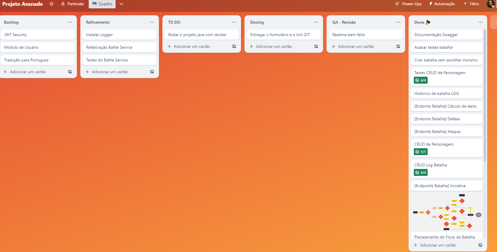
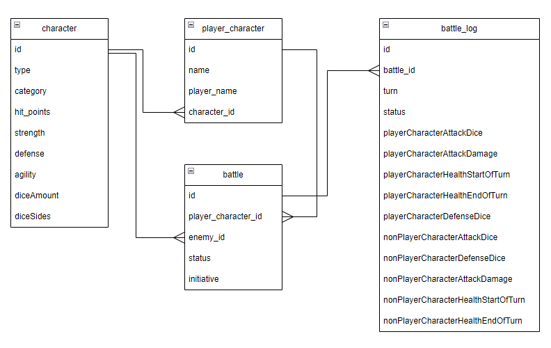

# SOBRE

> Projeto para o Bootcamp da ADA e Avanade.

Este projeto foi desenvolvido como parte do Bootcamp da ADA e Avanade, com o objetivo de criar uma API REST em Java com Spring Boot, integrada a um banco de dados Postgres, que oferecesse aos usuários a experiência de jogar RPG contra um sistema controlado por computador.

O foco do jogo são as batalhas contra os monstros e a possibilidade de criar novos personagens.

Foram desenvolvidos endpoints para realizar operações de CRUD em diversas áreas cruciais do jogo, incluindo:

- Gerenciamento de personagens do jogador.
- Criação e edição de personagens (Heróis e Monstros).
- Sistema de Batalhas com turnos e rolagens de dados.
- Registro de batalhas.

Ele foi desenvolvido seguindo os conceitos de tecnologia ágeis, fiz um controle por scrumban com o Trello para focar nos requisitos pedidos na documentação.

Procurei seguir e praticar ao máximo os princípios de SOLID e Clean Code que foram abordados no bootcamp.

## Tecnologias utilizadas
- Java 17
- Spring Boot
- Postgres
- Docker
- Swagger

## Modelagem dos dados

A estrutura de dados do projeto foi cuidadosamente projetada para garantir a eficiência e a integridade das informações.

## Fluxograma do jogo

O fluxo do jogo foi mapeado para oferecer uma visão geral do funcionamento do sistema.

Como funciona o fluxo do jogo:
1. O usuário cria um personagem ou escolhe um personagem existente.
2. O usuário cria uma batalha com o personagem escolhido, caso ele queira ele pode escolher um monstro como inimigo, se não escolher o sistema irá sortear um.
3. Com a batalha criada o jogador precisa fazer o teste de iniciativa, ele vai determinar quem ataca primeiro.
4. Se o jogador ganhar ele pode realizar o ataque, e se acertar ele deve calcular o dano causado.
5. Se perder ele devera realizar uma defesa, se o monstro acertar ele o monstro vai realizar um ataque.
6. Caso alguem fique com vida igual ou menor que 0 a batalha acaba e o vencedor é declarado.
7. Se os dois continuam vivos, o turno acaba e o processo se repete.

## Como rodar o projeto
- Clone o repositório
- Caso tenha o docker instalado rode o comando `docker-compose up -d` na raiz do projeto para subir o banco de dados Postgres na porta 5432 e uma imagem docker do backend na porta 9080. 

O banco será populado com os personagens iniciais.

> Caso não tenha o docker instalado, pode rodar o banco de dados localmente e alterar as configurações de conexão no arquivo `application.properties` na pasta `src/main/resources`.

Mas existem muitas maneiras de rodar o Spring Boot.

O projeto pode ser rodado pelo Maven usando os comandos:
- `mvn clean install` para instalar as dependências e gerar o pacote.
- `mvn spring-boot:run` para rodar o projeto

Ou caso prefira pode ser rodado como jar.
- `mvn clean install` para instalar as dependências e gerar o pacote.
- E se tiver o java na máquina pode tentar com o comando: `java -jar /target/adnd-0.0.1-SNAPSHOT.jar`

## Ambiente
Atualmente o projeto está configurado para rodar em ambiente de desenvolvimento.

## Swagger
O swagger foi utilizado para documentar a API e pode ser acessado em `http://localhost:9080/swagger-ui/index.html`

A collection de Postman utilizada está disponivel em: `https://www.postman.com/blue-shadow-247287/workspace/ada-avanade/collection/16884809-5cf7fdae-5b4f-400e-9566-3e98715c0e38?action=share&creator=16884809`